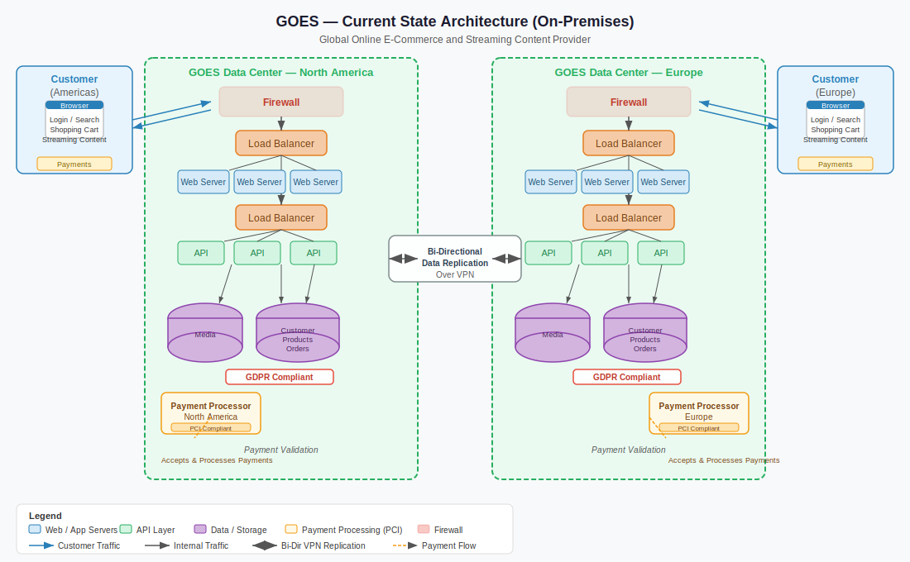

# Part 1: Architectural Strategy for Cloud Transformation

> **Duration:** 30–45 minutes
>
> **Back to:** [Interview Briefing](README.md)

---

## Scenario

- **Your Role:** Cloud Consultant
- **Client:** GOES — Global, Online E-Commerce and Streaming Content Provider
- **Current State:** On-premises (multiple physical data centers), self-managed
- **Strategic Direction:** Transitioning to a hybrid cloud environment

---

## Panel Stakeholders (Role-Play)

1. Application Stack Developer
2. Enterprise Architect
3. VP Engineering
4. Internal Business Stakeholder

---

## Objectives

Choose a cloud provider of your preference and guide the panel through the architectural transformation required.

- Design an architecture using **cloud-native patterns** that supports transitioning existing on-premise applications and infrastructure
- Address challenges of ensuring seamless operation in a **hybrid environment**
- Identify and discuss **potential risks** of moving to the cloud and propose mitigation strategies
- Highlight **opportunities** the cloud provides over their self-managed on-premise setup
- Demonstrate understanding of key transition considerations: **cost, security, scalability, and data management**

> **Note:** This segment does not require Elastic to be included. The focus is on your overall architectural understanding, migration strategy, and ability to identify risks and opportunities. Go both high-level and technically deep.

---

## Key Considerations

### Size and Scale
Large multinational business with operations across multiple continents. Millions of active users generating substantial data daily.

### Data Privacy and Compliance
Operates in regions with strict data privacy regulations (e.g., **GDPR in Europe**). Data storage and processing decisions must reflect these constraints.

### Complexity of Services
Offers multiple services in parallel:
- Online shopping
- Content streaming
- Online payment processing

### Peak Periods
Experiences significant traffic spikes (e.g., **Black Friday, Christmas**). Architecture must handle these loads without service disruption.

### Business Continuity
High availability and resiliency are non-negotiable. Significant downtime directly translates to substantial revenue loss.

### Innovation Mindset
Culture of frequent experimentation. Architecture must support **rapid changes and deployments**.

---

## Current State Architecture

The current environment spans two physical data centers (North America and East) connected via bi-directional VPN replication. Each DC runs web tiers, API tiers, databases, and PCI-compliant payment processors behind firewalls and load balancers.

---

## Deliverable

Prepare **diagrams** to visualize your architectural design. These can represent:
- A step-by-step transformation process
- Various aspects of the final (target) architecture

> **Template:** Download the [Elastic-branded PowerPoint template](presentations/goes-cloud-transformation-template.pptx) — 4 pre-structured slides with Elastic branding ready to fill in.

---

*← [Back to Interview Briefing](README.md)*
